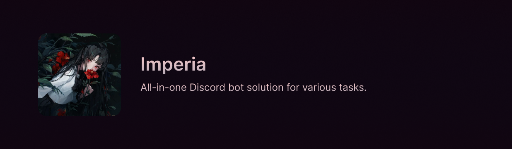

>  *Like a fading summer star, rising from the ocean to shine bright~*

## Overview

Imperia is a multipurpose Discord bot with extensive feature sets, including moderation, utility, and entertainment commands. The planned scope of the bot is to provide a wide range of features to Discord servers, with a focus on customization and user experience.

The name "Imperia" is of Latin origin; Typically feminine, and comes from the word Impĕro which means command, power, or imperial.

## License

This project is licensed under the [MIT License](LICENSE). Please refer to the license for more information.